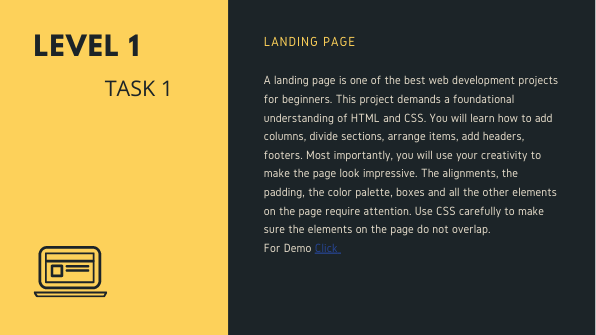
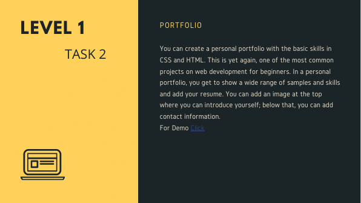
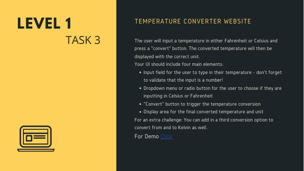

# **Oasis Infobyte Internship (OIBSIP)** 

**Level 1 Web Development and Designing**

**Task 1**

I have built a Landing Page for an Organisation. It has sections like Who we are, Our Mission, Our Team, Contact Us, Connect us and Join us.
To view that page [Click here](https://ankit-jds.github.io/OIBSIP/Task%201/index.html)

**Task 2**

I have built a simple Portfolio webpage for a Software Engineer like me. It has following sections: About, Experience, Education, Skills, Contact.
To view that page [Click here](https://ankit-jds.github.io/OIBSIP/Task%202/index.html)

**Task 3**

For this task I have built a simple Temperature Convertor which converts from Celsius to Fahrenheit and vice versa too.
To view that page [Click here](https://ankit-jds.github.io/OIBSIP/Task%203/index.html)
